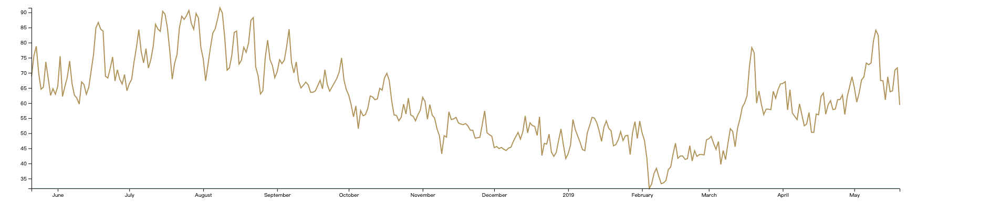
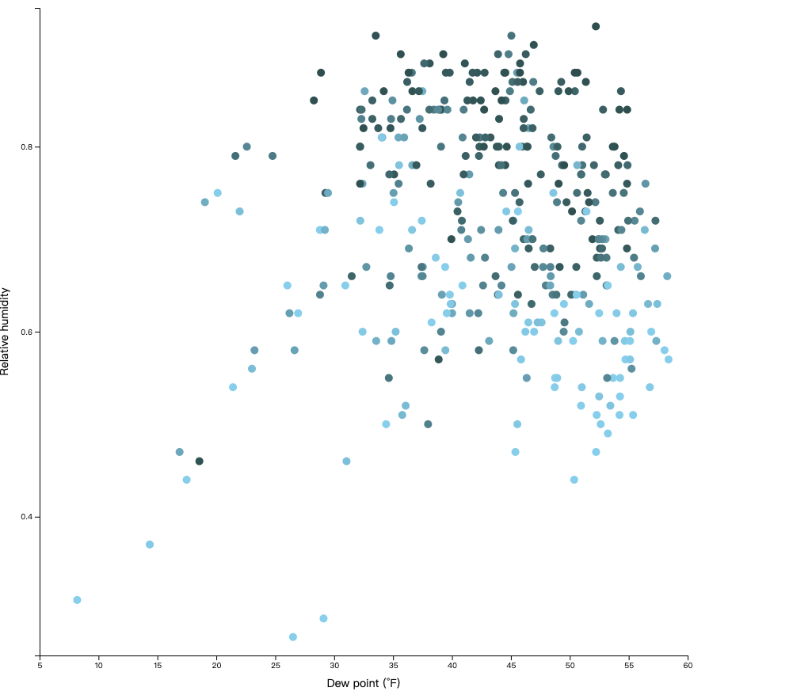
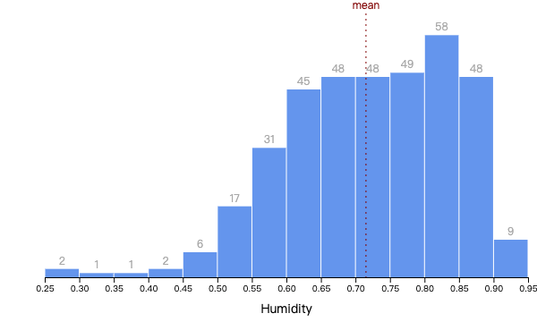

# Fullstack D3 and Data Visualization

Here are my study notes of [Fullstack D3 and Data Visualization](https://www.fullstack.io/fullstack-d3)

1. Example 01: Display the maximum temperature per day in Seattle over the past year, [view](https://pcu.gitee.io/fullstack_d3_and_data_visualization/01-making-your-first-chart/index.html)

2. Example 02: Display a scatterplot comparing relative humidity to the dew point, [view](https://pcu.gitee.io/fullstack_d3_and_data_visualization/02-making-a-scatterplot/index.html)
   

3. Display a histogram for humidity levels in Seattle, [view](https://pcu.gitee.io/fullstack_d3_and_data_visualization/03-making-a-bar-chart/index.html)
   

4. Animations and Transitions
   (1) svg animate, [view](https://pcu.gitee.io/fullstack_d3_and_data_visualization/04-animations-and-transitions/svg-animate.html)
   

   (2) svg animate, [view](https://pcu.gitee.io/fullstack_d3_and_data_visualization/04-animations-and-transitions/css-animate.html)
   

   (3) Draw bars with CSS transition, [view](https://pcu.gitee.io/fullstack_d3_and_data_visualization/04-animations-and-transitions/draw-bars-with-css-transition/index.html)
   
